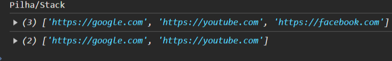

# Fundamentos de computação e algoritmos

Disciplina ministrada pelos professores Mario Souto e Edson Ifarraguirre Moreno.

## Escalonamento
Professor Mario Souto comenta brevemente sobre tipos de escalonamento, que o vertical necessita de maior investimento, e que o horizontal normalmente possui load balancer.

Falou sobre locais especializados em armazenamento de conteúdo estático (html, fotos) como o cloudFlare, além de servir de cache rápido ou CDN.

Também foi comentado sobre "Server Side Rendering" na AWS com EC2, e que nesse aspecto, erros também geram custos. Por erros, entende-se exceções não tratadas.

Professor Mario ainda comenta que a Vercel tem interface melhor que a AWS, mas usa AWS por baixo dos panos.

## Fila/Queue
Ainda na primeira parte da disciplina, o professor Mario comenta um pouco sobre fila, que é mais barato, que é um princípio básico da computação (FIFO - first in first out), e é um recurso que ajuda a parar de travar aplicações.

Por exemplo, configura-se uma API a ter no máximo 2 mil acessos, e partir disso fica numa fila da espera.

_Inevitável não pensar aqui nos aplicativos da caixa que tem fila virtual. Um bom exemplo é o aplicativo Loterias Caixa, que usa fila digital quando acontecem grandes eventos que demandam muitos acessos como a Lotofácil de independência ou a mega-sena da virada._

## Performance e otimização do frontend

Outro assunto abordado pelo professor Mario Souto foi performance.

Para isso, ele chamou atenção para HTTP Archive (tamanho do peso dos arquivos que trafegam na internet) e fez a analogia: "_whatsapp trafega menos coisa que um like no instagram_".

Comentou também sobre WPO stats (estatísticas de performance) e deu um exemplo de cenário do mundo real, onde por exemplo, se uma determinada request demora 100 milisegundos a mais para carregar algo, pode acarretar em perda de 1% de venda (um cenário fictício).

Usuários tem que ter a sensação de que a página está sendo carregada rápida. Se a espera demorar, acrreta em duas possibilidades:

- espera passiva, exemplo: fila de banco (tempo não passa, tedioso);
- espera ativa, exemplos: joguinho do dinossauro no chrome; apple com saphari tem um "truque" pra parecer mais rápido (tela vai pra baixo); placeholder {imagem} dá impressão que tá carregando...

Professor deu dicas de como melhorar a performance no aspecto de tráfego de dados, como por exemplo:

- minificar e concatenar arquivos p/ trafegar melhora performance;
- Routing, pegar servidor mais próxima.
				
## Princípios de programação

Nesta aula, alguns conceitos são postos pelo professor Mario. Ele comenta sobre o ato de procurar um bug, que é debug.

Foram dados alguns exemplos básicos de programação, aliando o alert do browser com o console, onde escrevemos um algoritmo que adivinha a idade.

HTML é texto. Dentro desse texto vai javascript.

Também foi trazido um exemplo de algoritmo que calcula o valor para o Uber, baseado na distância a ser percorrida.

O professor comenta sobre a importância de se validar parâmetros necessários para executar determinada rotina antes da execução. Menciona que é boa prática no Javascript, usar _has_ ou _is_ para variáveis ou funções que devem ter valores booleanos (_"na verdade isso é boa prática em qualquer linguagem, no Java também, inclusive eu faço isso mas em português... tem/eh"_).

Professor Mário ainda fala brevemente de APIs, como a do google maps, que basicamente são códigos prontos para utilizarmos na programação. O Alert do javascript é de uma API, e assim por diante.

## Banco de dados
Professor Mario comenta sobre banco de dados e faz analogia com uma planilha. Comenta que é exatamente a mesma lógica de banco de dados real.

O professor monta uma estrutura básica numa planilha:
- Pessoa
  - nome e cpf
- Carro
  - marca
  - modelo
  - placa
- Relacionamento entre carro e pessoa
  - Comentou que existem n formas de resolver um problema. Citou wordpress que é algo que abstrai o banco de dados.
	
## Browser
Professor comentou sobre os browsers, que servem para ler/interpretar html, javascript e css. Lidam com requisições (pegar imagem de tal site, o js de tal servidor, etc.).

Browsers possuem histórico (salva o title), favoritos. Em relação ao "favoritos", pode ser uma pasta que pode ter outras pastas ou páginas.

Começamos a desenvolver um protótipo "mini-browser" em javascript. 

Foi comentado sobre sites, que nada mais são do que links. Dentro de um HTML temos links para arquivos CSS, por exemplo.

## Estruturas de Dados
Continuamos no projeto do mini-browser, aproveitando ele para ver um pouco sobre estruturas de dados.

Desenvolvemos uma representaçao bem simples de duas abas, mas que são dois links um do lado do outro. Criamos os dois links com javascript adicionando dinamicamente no HTML do body da página com um for e manipulando o DOM com document.body.innerHTML.

Com este exercício do mini-browser, vimos um pouco de array, fila e objeto.

## FIFO/Filas

Professor Edson falou de fila usando um exemplo de array no javascript no browser.

Várias linguagens tem estruturas de dados (arrays), filas e suas variações. Java tem List<>, ou coisas como Iterable, entre outros que são exemplos de filas.

Foi comentado sobre métodos do tipo array (métodos prontos definidos no prototype de Array), push e shift **(o shift se encaixa no âmbito de fila, pois a fila, o primeiro a entrar é o primeiro a sair, então o shift tira o primeiro elemento da lista)**.

Aqui estamos falando de **FIFO (First In First Out)**.
	
Falou que a diferença entre fila e array é que array é uma estrutura de dados e fila é a representação "concreta". Estrutura de dados é como se fosse uma receita para criar novas filas.
	
O navegador/browser representa bem o uso de fila quando enfileira o disparo de requisições ao interpretar um determinado HTML. Isso porque ele vai precisar disparar requisições para baixar um determinado javascript, um CSS, uma imagem, etc.
	
Professor fez analogia com fila de requisições usando enqueue e dequeue. Quando termina uma requisição, desinfileira da fila com dequeue.
	
Professor falou de design first, ou seja, declarar a chamada das funções ou objetos antes de criar propriamente as funções para ver como vai ficar organizado.
	
Foi comentado de um princípio de programação chamado Open/Closed, que basicamente é, no Array você não pode modificar, e na classe Queue personalizada você personalizar da forma como quiser (foi o que entendi), parece quase um encapsulamento esse termo que ele falou. Não permite manipular diretamente "de fora" o array interno, somente através dos métodos que o acessam.
	
Sugestão de leitura recomendada: Martin Fowler Refactoring (tem pra java e javascript).

## LIFO/Pilhas
Professor Edson falou de Pilha e fez a analogia do stackoverflow (estouro de pilha) que é parecido com o loop infinito, quando não há mais recursos disponíveis.

Deu exemplo do site loupe (latentflip) que mostra de forma didática e lúdica com passo a passo o "debug" do javascript. Deu exemplo de uma função recursiva que fica se chamando o tempo todo e nunca termina.

No caso da pilha, o primeiro que entra é o último a sair. Isso porque é literalmente uma pilha de coisas, vai empilhando, o último que entrou é o primeiro que pode sair.

Nesse caso, no javascript temos a função de array pop, que faz isso, ela tira o último elemento de um array, no nosso caso do exemplo que o professor está dando, é o histórico de navegação que possui essa semelhança com o conceito de pilha.

**Aqui estamos falando de LIFO (Last In First Out)**

Então, usando o conceito de histórico de navegação do browser (botão voltar), implementou uma mini abstração do conceito de voltar do browser no exercício pilha.html. Começou adicionando páginas ao histórico com push e depois para "voltar" para uma página anterior, deu um pop().

A imagem acima mostra o que ele quis fazer.

## Função Map()
Professor falou da função Map que serve para criar listas de chave/valor, onde não é possível duplicar a chave. Mas não gera erro se tentar atribuir mais de uma vez a mesma chave.
	
Baseado num ID, sempre vai sobrescrever o último valor quando se tentar adicionar um com a mesma chave.
	
## Função Set()
A função Set é a mesma coisa que o Map, mas a diferença é que no Set só vai valor e não chave. Ou seja, não é um par que é adicionado, e sim um valor único.
	
## Diferença entre Map e Set
- Map: Armazena pares chave-valor. As chaves são únicas e podem ser de qualquer tipo.
- Set: Armazena valores únicos, sem chaves. Um valor não pode ser repetido dentro do Set
	
## Github
Professor falou do github para expor o portfólio dos códigos praticados durante a pós.
	
Falou do git, aplicação para versionamento, criado pelo Linus Torvalds.

## Pensamento Computacional
Problema -> algoritmo -> solução

## Introdução
Neste tópico foi apresentado um Hello World em Javascript.

Foram trazidos alguns conceitos básicos da linguagem Javascript:

- Linguagem baseada em objetos
- Dinâmica
- Fracamente tipada
- Falou de como é declarado variáveis em javascript.
  - escopo de let e const (local)
  - escopo de var (global)
- Comandos de repetição (for, while e do-while)
- Comandos de seleção (if, if-else, switch, condições ternárias)

## Modularização e Exemplo
Neste tópico, o professor tratou de criação de funções, onde criou uma função de exemplo para imprimir se é par ou impar usando for e if. 

## Complexidade algorítmica
Alguns questionamentos e reflexões foram colocados aqui.

Como saber se um algoritmo é eficiente?

Para responder a essa pergunta devemos levar em conta, consumo de recursos do hardware, tempo de execução.
		
O professor Edson observa que a contagem do tempo de execução nem sempre é uma boa medida, pois o processador pode estar envolvido em várias outras tarefas e isso afeta o tempo de execução da nossa aplicação.

## Avaliação de desempenho
Neste tópico é abordado a contagem de operações e o custo computacional como dois aspectos da avaliação de desempenho do algoritmo.
		
### Contagem de operações

Contar operações primitivas, como por exemplo, contar quantas unidades de tempo são consumidas sempre que se chama a atribuição de valor de variável. Tecnicamente é sempre um tempo constante.

Considerar tempos similares para comparações (IFs).
		
### Custo computacional

Aqui temos a princípio três possibilidades:
	
- constante
- linear
- quadrática (laço dentro de outro)
  - cúbico, exponencial fatorial (pior dos cenários possível)

## Arrays
Professor Edson falou das formas de declarar arrays.

Métodos padrão para manipulação de arrays (push, pop, shift, entre outros)

Também foi comentado de matriz.
	
Vimos na prática com uso de Array do Javascript o seguinte:

- Pilha (LIFO)
  - push (insere no final)
  - pop (remove no final)
- Fila (FIFO)
  - push (insere no final)
  - shift (remove no início)
	
## Conjuntos (Set)
Não permite duplicação de valores

útil para eliminar duplicados de um array criando outro com set.
	
## Conjuntos (Map)
Não permite duplicação de chave/valor.

Chaves nunca se repetem.

Funções uteis:
- has -> tem chave?
- get -> retorne o valor da chave
- set -> cria a chave com o valor
- delete -> exclui a chave/valor do map

Iteração em conjuntos:
- Não tem como fazer for simples
- usa-se for of (for in)
- iterar as chaves em ``myMap.keys``
- iterar os valores em ``myMap.values``

## Lista encadeada como estrutura de dados
Foi abordado as seguintes características da lista encadeada:

- Possui referência para a próxima posição
- Encadeamento de nodos
  - Cada nodo armazena informação do próprio elemento/valor, e a informação da próxima posição
- Exemplo (não programei, ele só comentou)
  - elemento
  - vínculo com a próxima posição
  - assim por diante
	
## Lista duplamente encadeada 
Aqui possui referência para a posição anterior e próxima.
	
## Árvores como estrutura de dados
Características:
- É uma estrutura não linear.
- Fez paralelo com estrutura de pastas e diretórios do windows
- DOM da página web também é um exemplo
- Armazena elementos de maneira hierárquica
- Todo nodo só tem um único pai, mas pode ter vários filhos
- nodo que não tem filho é externo/folha
- nodo que tem filho é interno/galho
	
## Recursão
Características:
- Consiste em solucionar partes menores do mesmo problema
- Finaliza quando o problema original foi resolvido
- Recursão é alcançada chamando-se a própria função
- Um método ou função será recursivo se ele puder chamar a si mesmo diretamente
	
## Recursão aplicado em árvores
Características:
- Árvores
  - Grau: nr. de sub-árvores de um nodo;
  - Nível do nodo: número de linhas que liga o nodo à raiz. Qual a camada que se encontra.
  - Altura: Quantos níveis tem, é o "níbel" mais alto da árvore.	
  - Métodos esperados em árvores:
    - root(): retorna a raiz da árvore;
    - parent(v): retorna o nodo pai de v, ocorrendo um erro se for a raiz;
    - children(v): retorna os filhos do nodo v;
    - isInternal(v): testa se um nodo v é interno e retorna true ou false;
    - isExternal(v): testa se um nodo v é externo e retorna true ou false;
    - isRoot(v): testa se um nodo é raiz e retorna true ou false;		
  - Métodos genéricos (não necessariamente ligados a estrutura, mas fazem sentido existir numa estrutura de árvore)
    - size(): número de nodos da árvore;
    - isEmpty(): testa se a árvore tem ou não tem algum nodo 
    - positions(): retorna uma coleção com todos os nodos da árvore;
    - replaceElement(v, e): retorna o elemento armazenado em v e o substitui por e;

### Árvore binária
É uma árvore ordenada com as seguintes propriedades:
- Todos os nodos tem no máximo dois filhos
- Cada nodo filho é rotulado como sendo um filho da esquerda ou um filho da direita
- O filho da esquerda precede o filho da direita na ordenação dos filhos de um nodo
			
Subárvores (características):
- O filho da esquerda de um nodo interno v é chamado de sub-árvore da esquerda
 - O filho da direita de um nodo interno v é chamado de sub-árvore da direita
		
Árvore binária própria ou cheia (características):
- Cada nodo tem 0 ou 2 filhos

As estruturas de árvores binárias são muito utilizadas na computação (visando ganho de desempenho)
		
Forma mais usual de implementação de árvore binária:
- Estruturas encadeadas (alocação dinâmica)
- Cada nodo conterá
  - A informação
  - Uma referência para o nodo pai
  - Uma referência para a subárvore da esquerda
  - Uma referência para a subárvore da direita
- Métodos:
  - boolean addRoot(element): retorna false se a árvore não está vazia, senão insere o elemento e o classifica como raiz.
  - boolean addLeft(element, fathre): insere o elemento e o classifica como filho de 'father', na subárvore da esquerda; retorna false se não encontrar father;
  - boolean addRight(element, fathre): insere o elemento e o classifica como filho de father, na subárvore da direita; retorna false se não encontrar father;
  - boolean hasRight(element): reotrna true se tem subárvores à direita;
  - boolean hasLeft(element): retorna true se tem subárvores à esquerda
  - Integer getParent(element): retorna o pai do elemento
  - boolean isInternal(element): retorna true se o elemento está num nodo interno;
  - boolean isExternal(element): retorna true se o elemento está num nodo externo;
  - boolean removeBranch(element): remove o elemento e seus filhos.
  - boolean contains(element): retorna true se a árvore contém o elemento;
  - boolean isEmpty(): retorna true se a árvore está vazia
  - void clear(): remove todos os elementos da árvore
  - int size(): retorna o número de elementos armazenados na árvore.
  - integer getRoot(): retorna o elemento armazenado na raiz;
  - void setRoot(element): altera o elemento armazenado na raiz
			
Formas de navegação (caminhamento) na árvore binária:
- Percurso em profundidade
  - percurso pré-fixado ou em pré-ordem
    - começa pela raiz (nodo é visitado antes dos seus descendentes). Vai indo pra direita, apresenta o resultado, vai pra direita.
  - percurso pós-fixado ou em pós-ordem
    - A última coisa é entregar o resultado, primeiro a navegação. 
    - Começa pela raiz. Quando volta da navegação dos filhos é apresentado o resultado. Quando chega no filho, tem mais filhos? Não, apresenta o resultado.
  - percurso central ou em ordem central
    - Começa da raiz. 
    - Tenho filho da direita? Tenho. Vou pro filho da direita. Tenho filho da direita? Não, apresento o resultado. Tenho filho à esquerda? Não, volta e apresenta o valor. Navego pro filho da esquerda. Tem filhos? Não, apresenta o valor.
    - **ANTES DE IR PRA ESQUERDA, SEMPRE APRESENTA O VALOR.**
  - Percurso em largura
    - Entrega primeiro nível, depois segundo nível na hierarquia, depois terceiro nível.
				
Mundo dos algoritmos:
Seguem algumas anotações que fiz na aula sobre estratégias de construção:
- Divisão e conquista
  - Quebra o problema em partes menores e independetes a partir da conquista que tivemos em pequenos problemas e depois a combinação dos resultados.
- Programação dinamica
  - quebra de problemas em problemas menores, mas independentes, mas mais independente.
- Gulosos (greedy)
  - Especialização/escavação em um único ponto
- Backtracking
  - Quando não tem mais evolução ele retorna (contrário do greedy)
- Motivação
  - Ordenação
    - Bubble sort: compara dois elementos por vez, passando por todo vetor n² vezes
    - Selection sort: Restringe o número de trocas realizadas ao longo da ordenação (número de trocas menor em relação ao bubble sort)
    - Insertion sort: Abre espaço para inserção, restringindo a área de comparação
    - Merge sort: Explore recursividade, quebra em vetores menores, quebrando o problema (divisão e conquista)
    - quick sort: define um pivô (sorteio), quem é maior vai pra um lado, quem é menor vai pro outro.
  - Busca
    - Busca linear/sequencial
      - um elemento após o outro (tem custo alto)
      - investiga cada posição da estrutura de dados
    - Busca binária
      - Se tá ordenado (ordem alfabética, p. ex.)
      - Exemplo do dicionário, quero a palavra maçã. vou abrir o livro mais ou menos no meio perto do M, vou dando saltos até chegar perto até chegar no elemento
					
## Conclusão

A minha análise sobre as aulas diz respeito a um sentimento de revisão dos conceitos básicos de programação vistos na graduação. Foi bom revisar estes conceitos considerando duas formas de tratar o assunto bem peculiares mas que se complementam: a visão de alguém de fora do meio acadêmico, no caso o Mário Souto que tem reconhecimento na internet pelo seu canal no youtube e a visão de alguém formado com este propósito mais de educador.

Inevitável fazer uma comparação no que diz respeito a didática de ambos, e perceber a diferença no aspecto das explicações. Professor convidado sempre muito esforçado para fazer entender de forma fácil usando de analogias do mundo real e o professor Edson trazendo a vivência acadêmica.

Acredito que foi um bom casamento, e a aula proporcionou muito bem esse nivelamento para permitir prosseguir os estudos das demais disciplinas.