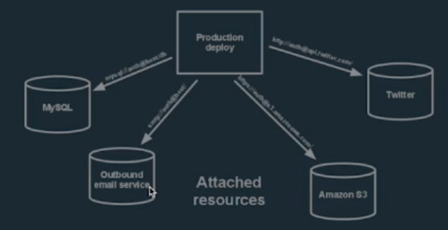
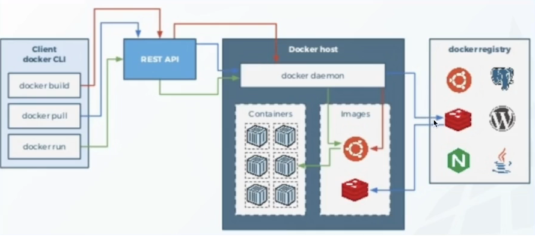

# Microserviços

Microsserviços nasceram devido a dificuldade de escalabilidade das aplicações construídas de forma tradicional, os chamados monolitos.

_"Numa das empresas que atuei, era tudo monolito, desde das aplicações Web até as aplicações Desktop. Toda e qualquer manutenção exigia uma liberação completa, ou atualização completa do sistema todo. Tempos depois quando entrei em outra empresa que utilizava microserviços, percebi que dar manutenção ficava muito mais tranquilo."_

A arquitetura de software orientada a serviços, caracteriza-se por várias APIs que possuem responsabilidades bem específicas de forma desacoplada.

## API Gateway
É um gerenciador de tráfego que faz interface com o serviço de back-end real ou de dados e aplica políticas, autenticação e controle de acesso geral para chamadas de APIs de forma a proteger dados valiosos.

Em outras palavras, é uma borda de entrada que esconde a minha infra-estrutura. Não vou expor as minhas camadas de negócio para a Internet. O usuário externo vai interagir com a API Gateway.

_"Aqui entra uma dúvida minha particular, e fui pesquisar na internet para entender:
Qual seria a diferença entre API Gateway e Backend For Frontend?
API Gateway destina-se a ser a porta de entrada genérica de um conjunto de microserviços de modo a orquestrar as requisições para essas aplicações, com foco na segurança (autenticação) e roteamento. Já o BFF, tem por objetivo melhorar a experiência do cliente que faz uso de um determinado backend. Melhorar a experiência do usuário do mobile ou da aplicação web que consome o mesmo backend, afinal em clientes diferentes, as necessidades podem ser diferentes."_

## Riscos ao adotar microsserviços
A governança é um fator que aumenta os riscos de se trabalhar com microsserviços quando pensamos em questões como:

Quais aplicações já temos em produção? O que já está pronto? Um catálogo, ou algo do gênero contribui para a governança dos serviços que já estão em produção, dos serviços que estão sendo desenvolvidos.

"_Na empresa em que trabalho hoje, a gente utiliza um serviço chamado backstage, que serve justamente para isso, catalogar as aplicações que temos em produção, de modo a facilitar a governança._"

## Características
Um conjunto de pequenos autônomos que trabalham juntos.

Software modularizado em pequenos serviços que se comunicam através de uma forma padronizada.

Se comunicam através de uma API Restful (HTTP / JSON).

### Escalabilidade horizontal x vertical
Na escalabilidade horizontal, é aumentado o número de réplicas (PODs).

Na escalabilidade vertical, a gente aumenta a quantia de RAM, HD, etc.

### Características Organizacionais
two-pizzas teams -> Equipes não podem ter mais gente que a quantia de pessoas que se alimenta de duas pizzas. 2 Pizzas devem ser suficientes para alimentar a squad.

## Práticas Recomendadas
### Modelar os serviços com base no domínio da empresa
Se eu trabalho num banco, vou ter um produto que é Crédito, outro produto vai ser o de Canais (de comunicação com os clientes), Financiamentos, etc.

### Descentralize tudo
Deixe as equipes independentes para projetar e criar os serviços. Evitar de criar bibliotecas para compartilhar entre os times, pois isso pode gerar um gargalo no sentido de que quando for necessário evoluir o código, todos terão que evoluir juntos, criando uma dependência semelhante ao monolito.

### Bancos de dados distintos
Cada microserviço deve ter seu próprio banco de dados. Os dados do negócio não devem ser acessados por outros negócios.

Pensando num sistema de eCommerce, onde temos clientes, vendas, produtos, etc. Somente a parte do cliente já é um ecossistema grande, pois precisamos gerenciar o cadastro (atualizar dados conforme a receita, etc). Então, é prudente que quando vamos fazer uma venda, que consultemos os dados dos clientes através de um microserviço de cliente, e não tudo no mesmo banco de dados. Isso é útil, por exemplo, se dá uma pane no banco de dados que tem todos os dados de todos os serviços, é mais fácil de contornar se estiver isolado/separado. Além de ser considerada uma boa prática.

### Definir contratos
Durante a fase de projetar a API, é bom já definir quais parâmetros (body da requisição) serão usados, e qual o retorno (response) vai ser feito.

As APIs devem modelar o domínio.

### Use a API Gateway
Deixe as preocupações com autenticação, terminação SSL para a API Gateway, ao passo que mantenha sempre fora do gateway o domínio do negócio.

## Falácias de Microserviços
Existem algumas falácias que o professor comenta na aula como:

- A rede é confiável. Não, a rede pode falhar;
- Latência é zero. Impossível! Se um serviço está hospedado em São Paulo e precisa de outro serviço que está em EUA, o tempo de latência pode ficar comprometido;
- A banda de internet é infinita. Não! A internet no Brasil tem lá seus problemas;
- A rede é segura. Não! Hackers estão à solta;
- Topologia da rede não muda. Muda! Ambientes cloud podem mudar o IP dinamicamente;
- Custo de transporte é zero. Não! É importante cuidar o tamanho dos payloads (objetos de req/response). Tráfego de rede custa caro.

## IaaS (Infraestrutura como Serviço)
Infrastructure as a Service.

Significa entregar computação de infraestrutura sob demanda.

É um dos 3 modelos de serviços da computação em nuvem.

IaaS provê:
- Servidores: computação e máquinas;
- Storage;
- Rede
- Sistemas Operacionais.

Possibilita escalabilidade dinâmica.

## PaaS (Plataforma como Serviço)
É como se fosse uma IaaS, mas com uma camada a mais, um middleware ou componentes prontos.

Exemplo prático: Tenho a necessidade de usar um Cache distribuído. Na IaaS, é necessário fazer isso manualmente, adquirindo uma máquina, instalando e configurando o cache. Já na PaaS, já tem algo pronto que abstrai essa necessidade de configuração manual.

Uma camada de abstração entre seu aplicativo em nuvem e seu provedor de IaaS.

Ambiente de execução escalável e com alta disponibilidade para aplicações customizadas. Nesse caso, fornece escala elástica - lembrei dos elastics computers da AWS, os chamados EC2.

**Desenvolvimento 100% focado no negócio** pois retiro a responsabilidade de me preocupar se os servidores vão cair, enfim, cuidados que normalmente precisamos ter com infra.

Produtividade: não precisar gerenciar balanceamento de carga, replicação, cluster, instalação e configuração de middlewares (servidores de aplicação), banco de dados, etc.

## The Twelve Factor for App
Trata-se dos 12 itens mais importantes que devemos levar em consideração quando estamos falando de aplicativos na nuvem.

### 1 - Base de Código
Repositório, onde guardamos nosso fontes (commits/push).

### 2 - Dependências
Meu software utiliza pacotes, bibliotecas, etc, então devemos usar gerenciadores de dependências como o Maven, Gradle, Npm, pip, etc.

A recomendação é sempre ter gerenciadores de pacotes no projeto. Antigamente existiam scripts .sh ou .bat para copiar bibliotecas de um diretório para dentro da pasta do projeto e hoje não precisa mais disso, o gerenciador dá conta de tudo.

### 3 - Configurações
Uma característica marcante em microserviços é o banco de dados, que deve ser único para cada API. E, com o uso de um banco de dados, inevitavelmente precisamos configurar a conexão com esse banco de dados, portanto, estes dados de conexão (usuário, senha, host) devem ficar armazenados em variáveis de ambiente.

Serão nas variáveis de ambiente que vamos armazenar outras informações bem importantes que tem relação com a parte de deploy, os ambientes:

- production
- homologation
- development
- staging (pré-produção)

### 4 - Serviços de Apoio
Tem a ver com arquitetura hexagonal.

Um serviço de apoio pode ser qualquer serviço que o App precise consumir, como por exemplo, banco de dados, mensageria (RabbitMQ, Kafka), cache (Redis).

Todos esses exemplos, devemos tratar como serviços de apoio, serviços de terceiros que não deve ser um problema da minha aplicação, do meu negócio.

Exemplo:

Nesta imagem, podemos ver que da mesma forma como eu consumo a API do Twitter, também consumo serviço da AWS S3, serviço de email, ou serviço de banco de dados. São serviços. São serviços de apoio.

### 5 - Construa, lance, execute
Precisamos de feedbacks rápidos. Preciso construir minha funcionalidade, entregar o mais rápido possível, e saber se ela atingiu o que eu quero, o que foi pedido.

Se der problema, tem que ser rápido o bastante para conseguir corrigir logo.

Temos 3 estágios principais portanto:

- Construção: converte o repositório em um pacote executável (JAR ou WAR trazendo para o mundo Java);
- Lançamento: Combina o artefato construído com a configuração do deploy;
- Execução: Roda o app no ambiente de execução através dos processos específicos do APP.

### 6 - Processos
Requisições não guardam estado. Microserviços são stateless.

Os aplicativos devem ser executados como um processo único e sem estado.

### 7 - Vínculo de Porta
Quando temos uma API qualquer, ela opera num host e numa porta. Obviamente, se subirmos uma API na porta 8080, não vou poder subir outra API diferente na mesma porta, pois vai dar conflito.

Ter sempre mapeado em quais portas os serviços estão utilizando. Existem ferramentas de mercado para facilitar isso.

### 8 - Concorrência
Divida seu aplicativo em pequenos pedaços, para não dificultar a execução como um todo. Desenvolver a aplicação de modo que ao fizermos um aumento de escala horizontal (mais CPU ou mais núcleos, por exemplo), a aplicação utilize os recursos adequadamente.

### 9 - Descartabilidade
Os processos devem consumir menos tempo. A chamada da execução de um determinado serviço deve acontecer, e terminar rapidamente.

Certifique-se de poder rodar e parar rapidamente. Lide com falhas. 

**Dica: uso de contêineres.**

### 10 - Paridade entre Desenvolvimento e Produção
Manter os ambientes de desenvolvimento, homologação e produção o mais parecidos possíveis. Idempotência.

Não posso ter mensageria somente no ambiente de produção, nem cache, tenho que ter ambientes semelhantes.

Cultura devops.

**Dica: de novo, contêineres.**

### 11 - Logs
Trate logs como fluxos de eventos.

Logs são importantes para validar erros e verificar integridade geral do sistema, mas não deve ser uma preocupação da minha aplicação o armazenamento dessas informações. Outro serviço separado deve ser responsável por armazenar esses logs de fluxo contínuo.

### 12 - Processos Administrativos
Evite fazer UPDATEs ou ALTER TABLEs em produção de forma manual.

Existem processos, ferramentas que podemos usar para que as alterações sejam feitas primeiro no ambiente de desenvolvimento, depois no ambiente de homologação e por último no de produção, depois que tudo esteja devidamente validado e testado.

## Aplicações Cloud Native
Uma aplicação considerada cloud native tem alguma das seguintes características:

- Devops
  - Processos
  - Ferramentas
  - Cultura
- Entrega contínua
  - Automação
- Microserviços
  - Automação;
  - Registro e descoberta
  - Rastreamento distribuido / observabilidade
  - Anti-fragilidade / Engenharia do caos. Aqui trata-se de analisar como a aplicação se comporta quando alguma parte da infraestrutura fica off. Existem ferramentas para injetar falhas na aplicação.

Características específicas:

- Modularidade;
- Capacidade de observação;
- Implementabilidade;
- Testabilidade;
- Descartabilidade;
- Substituível;
- Criado para ser escalável (horizontal e vertical);
- Tolerante a falhas;
- Decomposto em serviços;
- Envia o máximo trabalho para a plataforma se possível;
  - Aplicação é responsável pelo domínio, sem se preocupar com essas questões de autenticação.
- Automatizado.
  - Commit, aperta um botão, sai em produção.

## Containers
"_Mas na minha máquina funciona :)._"

É um pequeno sistema Linux, minimalista. Compartilha o kernel do host. Os processos são trabalhados isoladamente. Tem versionamento de containers. Compartilhamento de ambientes customizados.

Porque os contêineres são bons para microserviços?

Microserviço é projeto para rodar isoladamente, um contêiner é projeto para ter somente um processo rodando dentro dele.

É muito leve.

## Docker
Tecnologia open source que permite criar, executar, testar e implantar aplicações distribuídas dentro de containers de software.

A mesma aplicação que eu coloquei em teste, tem que ser em produção, homologação, etc.  

### Imagem
Templates que são usados para criar containers.

É composto de camadas. Faz cache de camadas.

Um servidor com aquela versão X do Java, versão X do Linux.

### Dockerfile
Scriptar a construção de um contêiner.

### Docker registry
Como se fosse um repositório git de imagens docker. Docker hub é o repositório oficial do Docker.

"_Dica: Pegar imagens de repositórios confiáveis e oficiais. Qualquer um pode subir imagens no Dockerhub._"

### Arquitetura Básica
Esta imagem representa a arquitetura básica do Docker:

 
## Maturidade com Cloud Native
Cloud native é algo muito novo, a maioria das empresas não tem experiência para trabalhar desta forma. Erros de implementação podem custar muito caro.

Existe uma matriz de maturidade para medir o quanto a minha empresa, meus processos, estão maduros o suficiente para evitar erros simples e também os que custem muito caro de forma desnecessária.

Níveis de maturidade cloud native:

- 0 - Cloud Ready -> infraestrutura virtualizada, criação das instâncias ou imagem por script;
- 1 - Cloud Friendly -> Serviços vagamente acoplados, descobertos pelo nome (não usar IP), computação e armazenamento ficam separados;
- 2 - Cloud Resilient -> Tolerante a falhas, se desligar uma parte da infra a aplicação não cai. Serviços independentes;
- 3 - Cloud Native -> Transferível entre provedores em tempo de execução sem que o usuário perceba. Escalonamento horizontal automático conforme demanda.

## Particionamento de Serviços
Como determinar se devo construir um serviço ou microserviço de modo que ele possa ser reutilizado?

Para isso existe o **Domain-Driven-Design**, ou DDD.

## Domain Driven Design
O DDD, é uma abordagem que reúne um conjunto de boas práticas, padrões, ferramentas e recursos da orientação a objetos que têm como objetivo a construção e desenvolvimento de sistemas de acordo com o domínio e regras de negócio do cliente.

Caracteriza-se primeiramente por um forte estreitamento entre a equipe de programadores e a equipe de especialistas no negócio.

Demais características:

- Principal conceito é o modelo/domínio.
- Pode ser criado fazendo desenhos, fluxogramas, etc.
- Deve representar o negócio do cliente
- Linguagem onipresente
  - linguagem ubíqua, qualquer pessoa, ao ler o documento ou o código, consiga entender qual é o objetivo, qual o propósito.
    - O PO do projeto pode querer ver o código, mesmo sem entender Java ou qualquer outra linguagem. Tem que estar claro o que cada coisa faz.
- Arquitetura em camadas.
  - Posso querer trocar uma camada mais na ponta, na parte de interação com o banco de dados, por exemplo, mudar o ORM, ou algo do gênero, sem quebrar a aplicação.
- Padrões de desenvolvimento.
  - Toda empresa segue um padrão.
- É uma abordagem de desenvolvimento de software que reúne um conjunto de conceitos, princípios e técnicas cujo foco está no domínio e na lógica do domínio com objetivo de criar um Modelo de Domínio.
- O domínio tem que “falar a língua” do usuário usando o que é conhecido como linguagem ubíqua, ou linguagem comum.

### Camadas do DDD
Quando pensamos num desenvolvimento com DDD, temos 4 camadas principais partindo do mais baixo nível para o mais alto nível:

- Camada de Infraestrutura
  - Repositories
  - Adapters
  - Frameworks
- Camada de Domínio
  - Estado do domínio;
  - Comportamento do domínio
  - Lógica do negócio;
  - Solução do problema
- Camada de aplicação
  - Gerencia as transações;
  - Traduz os DTOs;
  - Coordena as atividades da aplicação;
  - Cria e acessa objetos de domínio;
- Camada de acesso ao Usuário
  - Aceita comandos do usuário e apresenta a informação de volta ao usuário.

### Modelo
O modelo começa pequeno e evolui a medida em que especialistas da equipe técnica e da equipe de negócio interagem.

O desenvolvedor tem que ter propriedade, tem que conhecer muito bem o negócio a ponto de debater com a equipe técnica da regra de negócio.

### Eventos de Domínio
Precisamos entender como os eventos do negócio se relacionam. Quais eventos temos?

Coisas que aconteceram, é passado. Exemplos: produto ativado, produto desativado, licença utilizada, licença liberada, novo ambiente criado.

### Comandos
Vem depois de mapear todos os eventos.

A chave para encontrar os comandos do sistema é questionar, porque esse evento ocorreu?

Os comandos são ligados aos eventos. Por exemplo, para o evento contrato ativado, existe o comando “Ativar contrato”.

**Um microserviço deve comunicar com no máximo 8 outros serviços. Senão vira um monolito distribuído.**

## Coreografia x Orquestração de Serviços
A coreografia é mais lenta, mais demorada. Já a orquestração define ordens de eventos que devem ser disparados em sequencia.

