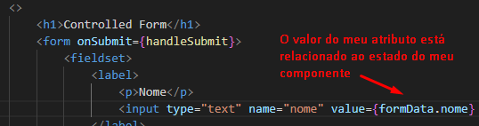
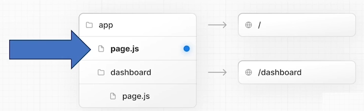

# Arquitetura client side

Aula ministrada pelos professores André Luiz Mendes Pereira e Júlio Henrique Araújo Pereira Machado.

## Conteúdo

Dentre os vários conteúdos vistos em aula, o que mais me chamou atenção foi o React e Next.

Dentro do React, vimos:

* Ferramentas de construção;
* Componentes;
* JSX;
* Hooks;
* Consumo de APIs REST;
* Formulários

O `index.js` de um projeto react é o bootstrap, o que dá a partida na execução do projeto

### Instaladores

Professor Júlio comenta duas formas de criação de uma aplicação Javascript client-side:

* npm create react app
* npm create vite@latest
  - Gera arquivos .jsx

São duas possibilidades de criação de um novo projeto.

### Outras IDEs

Professor comenta de outras opções além do VSCode:

* CodeSandBox
* StackBlitz
* replit

### Componentes

Devemos priorizar no início a construção de componentes React.

Uma inferace de usuário React é uma composição de componentes.

A ideia é cada componente ter uma responsabilidade única (S do Solid).

Professor Júlio faz uma observação que a componentização por meio de classes no React ficou depreciada, é considerado código legado. A estratégia que superou essa abordagem é através de funções.

Podemos misturar Javascript puro com JSX.

A convenção para componentes JSX é declarar os nomes com as iniciais em Maiúsculo.

Componentes podem receber dados do "mundo externo". Parâmetro da função é um objeto conhecido como `Props`.

#### Listas

Necessário ter o atributo key em listas.

**Jamais invente de gerar um valor de ID/Key programaticamente.**

#### Eventos

Nomes dos eventos são camelCase, começam com minúsculas.

- onClick -> tem uma função handleClick()

Professor comenta sobre o bubbling (evento sobe na árvore DOM até a raiz e depois ele desce). Também falou de como parar a propagação do evento com `stopPropagation`. Nesse caso, estamos falando de HTML e não de React. O exercício que ilustra é o [demo_react_componentebasico](./exercicios/demo_react_componentebasico).

#### Hooks

Hooks são funções que tem um comportamento especial no ciclo de vida dos componentes gerenciados pelo React. Estes hooks estão intimamente relacionados ao ciclo de vida de renderização dos componentes.

Um dos mais famosos é o `useState`.

##### `useState`

`useState` -> Função que entra um estado e devolve um novo valor de um outro estado. Nunca altera o estado.

No exemplo construído em [demo_react_usestate](./exercicios/demo_react_usestate), o react não renderiza tudo de novo, apenas altera o estado do componente que configuramos.

Outro hook mencionado pelo professor é o `useReducer`.

##### useReducer

O `useReducer` depende de uma função responsável por toda a manutenção do estado do componente. A função de redução tem 2 argumentos: primeiro é o estado atual do sistema, segundo a função a ser efetuada.

Exercício disponível em [demo_react_usereducer](./exercicios/demo_react_usereducer).

##### useEffect

Usar com cuidado devido possibilidade de causar efeitos colaterais na aplicação.

Normalmente usado quando precisamos invocar algo externo ao nosso componente.

Professor Julio dá uma explicação bem detalhada do exemplo do hook `useEffect`, passo por passo da construção do código e do efeito que isso causa na renderização.

Ressalta-se que é algo externo. Não é o própio componente que está mudando algo.

Fizemos um exemplo bem simples em [demo_react_useeffect](./exercicios/demo_react_useeffect), mas que já ajuda a ter uma compreensão bem interessante sobre como o `useEffect` funciona.

##### Hooks customizados

Podemos criar nossos próprios hooks. Na aula, o professor dá o exemplo do "online" e "offline" do browser.

##### Gerenciamento de Estado

Se o gerenciamento de estado aumentar no quesito complexidade, pode ser que o React não nos atenda. Então duas APIs são comumente usadas para isso:

- Redux
- Recoil

### Formularios

Vimos dois tipos de formulários no React:

- Sem controle dos componentes;
- Com controle dos componentes.

No form sem controle dos componentes, o React não está gerenciando o estado. No exemplo, estamos pegando os valores diretamente da DOM, do html.

Já no form com controle, é o react que gerencia o estado dos dois inputs.

### SPA e React

A partir do momento em que começamos a ter várias dependências diferentes em nossa aplicação, e a complexidade vai aumentando, fica evidente a necessidade da adoção de coisas como a Clean Architecture para organizar tudo.

Por conta disso, o professor Júlio recomendou este [repositório](https://github.com/falsy/clean-architecture-for-frontend) no github que mostra um exemplo de implementação de uma aplicação React com Typescript seguindo os princípios da Clean Architecture.

### Frameworks

React puro não resolve problemas de organização de um projeto complexo. Precisamos de coisas como Redux/Recoil para gerenciamento de estado, dependências externas para melhorar a experiência com formulários, etc.

Quando a aplicação começa a ficar complexa é hora de olhar para algum framework. No caso da aula, vimos **React + Next.js**.

#### Next.js

É um framework fullstack para o desenvolvimento de aplicações web com base em componentes React.

Fornece:
- Roteamento;
- Renderização no lado cliente e no lado servidor;
- Gerenciamento de acesso a dados (consumo de web services)
- Suporte a processamento de CSS;
- Otimização de conteúdo;
- Streaming de HTML dinâmico;
- Componentes no lado do servidor;
- Código de middleware.

Comando para criação de aplicações next:

`npx create-next-app@latest nome_da_aplicacao`

(Professor comentou no projeto de exemplo do Next.js um pouco sobre o `Tailwind.css`. O objetivo dele é ganhar produtividade com estilos CSS com uma infinidade de classes já prontas para cores, fontes, etc.)

##### Roteamento

Usamos no exemplo `app-router` que suporta a ideia do client-side rendering, server-side rendering.

Tudo que estiver dentro de `app` será controlado por app-router. Tudo é baseado de forma hierarquica, no sistema de arquivos:

Não precisa de nenhum arquivo de configuração. As rotas são conforme a hierarquia de pastas. Cada diretório com um `page.js` dentro representa uma rota.

O arquivo `layout.js` definido na '/' da aplicação extende esse layout a todos os filhos, ou seja, todos os diretórios hierarquicamente inferiores.

No next, temos alguns componentes React prontos, por exemplo o `<Image />`.

No next, temos rotas para páginas `page.js` e rotas para APIs `route.js`.

No âmbito das rotas, temos dois tipos de componentes:

- Server components;
- Client components.

Por padrão, todo componente jogado para dentro de app/router, vira `server component`.

Nos exemplos anteriores que fizemos com React puro, era tudo client-side rendering.

Já aqui no next é server-side rendering, por estar em `app`.

Achei interessante aqui o comentário do Professor Júlio, que o roteamento no Next é uma espécie de pilha. Vou empilhando rotas, e se quero voltar, vou desempilhando. Inclusive o método que navega para outra rota do hook `useRouter` é um `push` (o que dá justamente essa impressão de empilhamento).

Além disso, o Next é um framework que possibilita (e faz a gestão) de uma mescla de componentes, podemos ter server components e clients components juntos. Um `fetch` pra buscar dados de uma API é um server component. Um listener do tipo `onChange` é um client component. Vai depender o contexto do que é esperado do componente. Se ele é mais próximo do servidor ou se é mais próximo do cliente.

Por fim, usamos o exemplo disponível no [github](https://github.com/Yazdun/next-fcc-familyguy/tree/starter) para analisar a estrutura e o funcionamento do `app-router` no Next.js. A aplicação simula um servidor interno onde podemos fazer requisições HTTP para buscar dados dos personagens. As requests pegam os dados de arquivos locais .json. Então há essa mescla mencionada anteriormente de componentes do tipo server e do tipo client.

## Atividades práticas

No diretório [exercicios](./exercicios/) encontram-se exercícios práticos desenvolvidos durante a aula.

## Conclusão

Os estudos, os exemplos práticos desenvolvidos da arquitetura client-side foram feitos com componentes react. O gerenciamento do todo foi agregado o framework do Next.js.